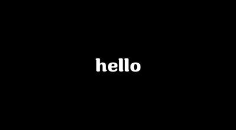
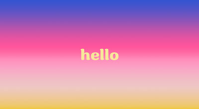
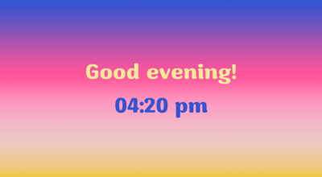
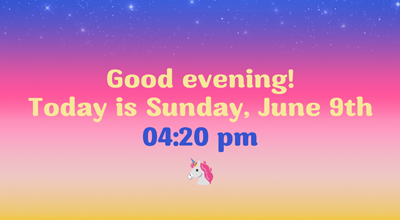
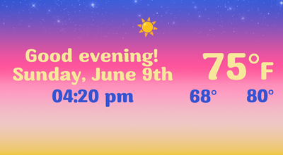
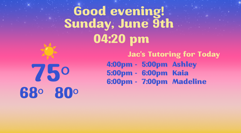

# Hello Display <!-- omit from toc -->

## Table of Contents <!-- omit from toc -->
- [Intro](#intro)
- [Ideas](#ideas)
- [Resources](#resources)
- [Version History](#version-history)
  - [Version 0.0](#version-00)
  - [Version 1.0](#version-10)
    - [Version 1.2](#version-12)
- [What I've gained](#what-ive-gained)
- [Other notes](#other-notes)

## Intro

I am a beginning CS student. My goal is to create a simple project from scratch that can be slowly improved with small iterations. Ideally I wanted a project using python and my raspberry pi. 

Trying to think of something fun but without an intimidating scope, I was inspired by my fiance's creation of a restaurant database that reccommends the next meal based on recent eating activity. I thought that it would be nice if I could have a display in the dining area that showed the top reccommend place to eat today.

This program is a personal display screen for the home. It's first iteration will be overwhelmingly simple: a full screen display of white text on black that says "hello". Slowly I wish to add functionality (cycle through different greetings, clock, calendar, weather, etc) so that ultimately there is a little display with a bunch of helpful info for the day. Perhaps unsurprisngly, my original idea (showing reccommended restaurants) is currently beyond the scope of this project.

## Ideas

- ~~full screen black~~
- ~~press "esc" to close the program~~
- ~~greeting widget white text \"hello\"~~ 
- ~~colorful background and text~~
- ~~pleasant font~~
- ~~update greeting widget: "\[Greeting!\] This time now is \[time\]", with the greeting based on the time~~
- ~~weather widget: current temp, today's high and low, and an emoji representing the weather~~
  - ~~I'm thinking of using an API?~~ I did it!!🤩
  - ~~I'll also need to be able to handle the emoji 🦄~~ I'm just using images...
- ~~schedule widget: Jac's schedule (primarily students I'm tutoring)~~
  - ~~should the day/date be with the greeting or schedule widget? I feel like schedule ultimately~~
  - ~~I need to figure out the best way to store this info to be able to easily access it~~ (currently using a csv I need to manually update)
- food-rec widget: show the top 3 food recs for the day
  - requires access to the notion database... I think this is hard
- settings plane: press the "s" key to show settings. Press either a "cancel"/(press delete) or "apply"/(press enter) button to exit back to main plane
- theme widget in settings plane: choose between colorful or black and white
- widget widget in settings plane: choose which widgets to display
- random emoji
- show the moon phase!
- a button that brings up a window that let's you see all of Jac's schedule and edit it?!

## Resources

- sunrise bg image
- Ratox font
- emoji images

## Version History

### Version 0.0
Completed 2024-03-27

The screen is filled with a black window. Pressing "esc" ends the program thus closing the window.

#### Version 0.1 <!-- omit from toc -->
Completed 2024-03-27

The screen is filled with a black frame with the word "hello" in white center screen. Pressing "esc" ends the program thus closing the frame.

Changelog:
- added white "hello" text in Ratox font in the (approximate) center of the screen

#### Version 0.2 <!-- omit from toc -->
Completed 2024-03-29

The screen is filled with a colorful frame with the word "hello" in yellow hue center screen. Pressing "esc" ends the program thus closing the frame.

Changelog:
- fixed the position of "hello"
- added colorful "sunrise" background
- the now yellow "hello" successfully sits on the background
  without a containing rectangle (i.e. transparency works)

Note:

Changed code structure from:

>root -> mainframe -> BG (Label) -> "hello" (Label)

to:

>root -> canvas (then canvas draws bg and "hello")

This makes the code easier and cleaner, with the added benefit 
of removing the gross "padx/pady" code from before!!

#### Version 0.3 <!-- omit from toc -->
Completed 2024-03-29

The screen is filled with a colorful frame. The word "Hello!" 
and the current time are displayed on-screen
Pressing "esc" ends the program thus closing the frame.

Changelog:
- increased font size (70 -> 100)
- changed greeting to "Hello!\nThe time is now"
- added a functioning clock below the greeting

#### Version 0.4 <!-- omit from toc -->
Completed 2024-03-29

The screen is filled with a colorful frame. A 
time-appropriate greeting ("Good morning!","Good night!",etc.) 
and the current time are displayed on-screen
Pressing "esc" ends the program thus closing the frame.

Changelog:
- changed static greeting to a dynamic one (changes every 4 hours)

### Version 1.0
Completed 2024-03-30

The screen is filled with a colorful frame. A dynamic greeting,
the current day, date, time, and random emoji are displayed on-screen.
Pressing "esc" ends the program thus closing the frame.

Changelog:
- there are now some stars in the bg
- added day and date
- added a randomized emoji (from small set)

#### Version 1.1 <!-- omit from toc -->
Completed 2024-03-30

The screen is filled with a colorful frame. A dynamic greeting,
the current day, date, time and weather info are displayed on-screen
Pressing "esc" ends the program thus closing the frame.

Changelog:
- using NWS API, added current/low/high temps
- replaced the randomized emoji with one based on current forecast
- adjusted layout to accomodate new content

#### Version 1.2
Completed 2024

The screen is filled with a colorful frame. A dynamic greeting,
the current day, date, time and weather info are displayed,
as well as Jac's tutoring schedule for the day.
Pressing "esc" ends the program thus closing the frame.

Changelog:
- tried to clean up the weather emoji function
- lowered FONT_H, therefore changing the vertical spacing of display elements
- changed the low/high temps from 24-hr measurements to 12-hr measurements
- added functionality to read Jac's tutoring schedule from an csv and display today's students
- added schedule to the display
- adjusted layout to accomodate new content

## What I've gained

- Great practice with markdown!
- Better understanding of the TKinter library
  - The discovery of canvas has been particularly great! (v0.2)
  - canvas.itemconfig() has been a game changer! (v0.3)
- Some new understanding about virtual environments in VScode
- learning about the time and datetime libraries
- some very positive experience using ddb, CS50's rubber duck coding AI
- I sought out, found, and successfully used a weather API!! Stupid proud of this. (v1.1)
- Then I created a csv file with the necessary data to display the day's tutoring schedule on screen! (v1.2)

## Other notes

I just took SPD, and I feel I've only in the smallest way been able to apply what I've learned in that class to this project. (I loved that class!!) But this is Jac at version 1.0, so maybe it will become more applicable. (v1.2 Jac: The main takeaway from SPD that I've applied is the idea that a project of any size can be broken down and all you have to do is the next thing, not the whole thing.)

I struggled a lot at the beginning of the project. I find the coding loop to be something like: 

>struggle (aka try/search/fail) -> successfully discover -> huge amount of progress -> next barrier -> repeat the loop. 

Unfortunately the "next barrier/struggle" stages take way longer time than the "discover/progress" stage, or it seems that way in the beginning.

In all disiplines, there are maxims repeated by the experienced to the beginners that for some reason the beginners just don't believe. (I'm a math tutor, and I have a hard time convincing a lot of students to write down their work. They react like some do during the beginning of Systematic Programming Design: "why do we have to do that, I don't think we do, actually...".) The one that I learned surprisingly early is how much you have to go back and change code that was already working because you had to change something else and everything's connected. (Restructuring? Reformating? I feel like there's a coding word here I forgot (edit: refactoring!!)). I've been told to prepare for this, but haven't experienced it to this degree until now, and I guess I didn't believe it!!

The point API (for Brea) I used to get the grid forecast api:
https://api.weather.gov/points/33.9165,-117.9003

